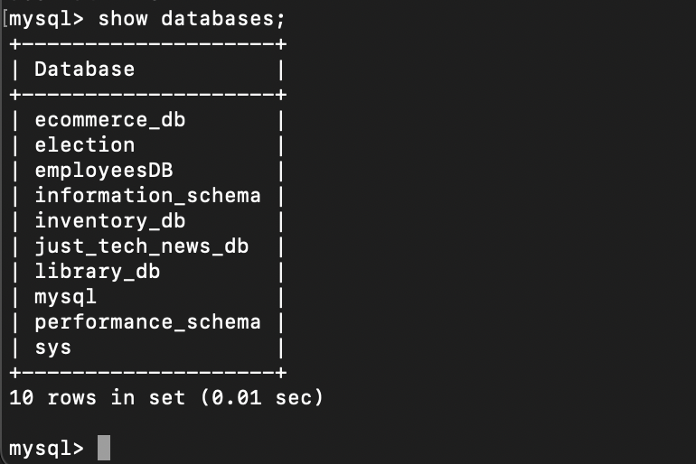
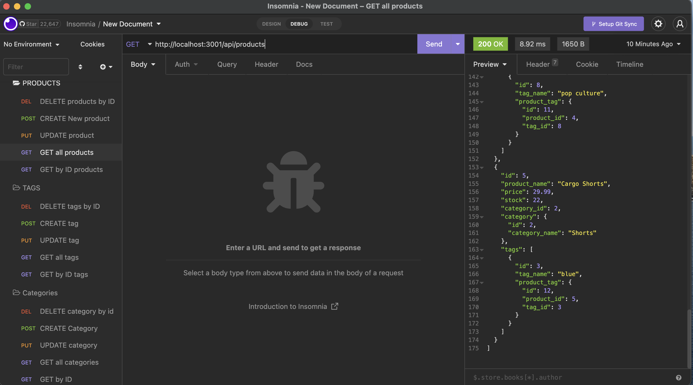

# E-commerce-BackEnd
Built the back end for an e-commerce site working Express.js API and configured Sequelize to interact with a MySQL database.

### User Story
```text
AS A manager at an internet retail company
I WANT a back end for my e-commerce website that uses the latest technologies
SO THAT my company can compete with other e-commerce companies
```
- [Link to video use of application](https://drive.google.com/file/d/19drtM5y5bCv2XA9ZiQY9iV1GbCt8cEc2/view)

### Node packages and languages
- Sequelize
- MySQL2
- Express
- Dotenv
- Javascript

### Installation
1. Clone from GitHub
2. Open project directory

### Instructions on how to run the app
1. Npm init -y
2. "Npm install" for all node packages
3. Source MySQL datebases scheema in MySQL command-line interface "SOURCE db/schema.sql;"
4. Run "Npm run seed" command in regular terminal.
5. "Npm start" to start the application server.
- Make sure to add a .env file to the root of the app with the following details**
```text
DB_NAME='ecommerce_db'
DB_USER='xxx'
DB_PASSWWORD='xxx'
```

### Screenshot (MySql Databases in terminal)

### (Insomnia Route folders)


### Contact or questions
[Coleyrockin Github](https://github.com/coleyrockin)

[Coleyrockin@aol.com](mailto:coleyrockin@aol.com)


