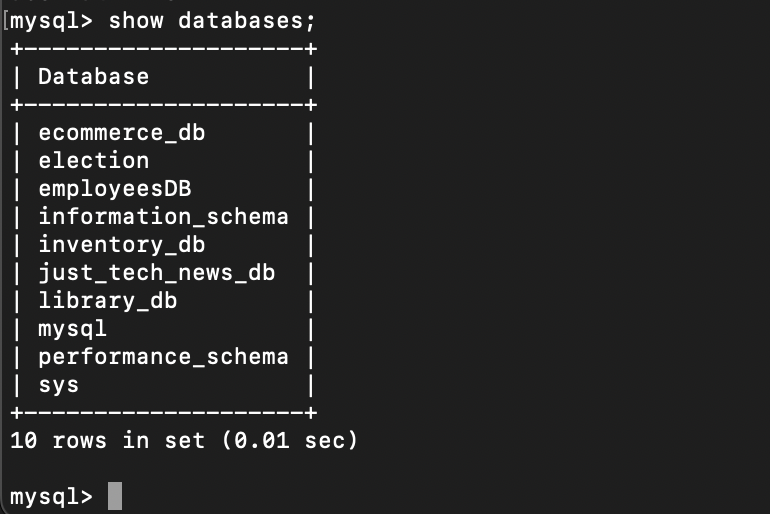
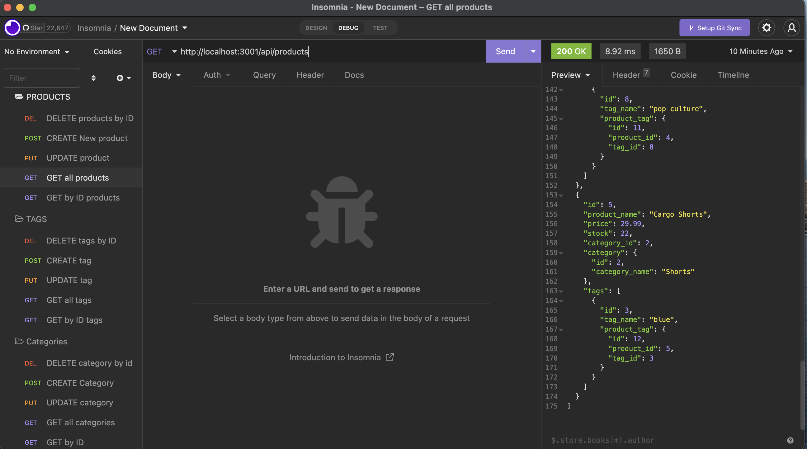

# E-Commerce Back End


## About

A RESTful API back end for an e-commerce site built with Express.js and Sequelize ORM. Provides full CRUD operations for products, categories, and tags through a MySQL database. Designed for testing with Insomnia or any REST client.

## Features

- Full CRUD API for products, categories, and tags
- Sequelize ORM with model associations and validations
- RESTful route structure with Express Router
- Database seeding with sample e-commerce data
- Environment variable configuration with dotenv
- Many-to-many relationship between products and tags

## Tech Stack

| Layer | Technology |
|-------|------------|
| Server | Node.js, Express.js 4 |
| ORM | Sequelize 5 |
| Database | MySQL, mysql2 2 |
| Config | dotenv 8 |
| Dev Tools | Nodemon 2 |

## Getting Started

```bash
# Clone the repository
git clone https://github.com/coleyrockin/E-commerce-BackEnd.git
cd E-commerce-BackEnd

# Install dependencies
npm install

# Create a .env file in the root
# DB_NAME='ecommerce_db'
# DB_USER='your_mysql_user'
# DB_PASSWORD='your_mysql_password'

# Create the database
mysql -u root -p < db/schema.sql

# Seed the database
npm run seed

# Start the server
npm start
```

The API runs at `http://localhost:3001` by default.

## API Routes

| Method | Endpoint | Description |
|--------|----------|-------------|
| GET | /api/products | Get all products |
| GET | /api/products/:id | Get one product |
| POST | /api/products | Create a product |
| PUT | /api/products/:id | Update a product |
| DELETE | /api/products/:id | Delete a product |
| GET | /api/categories | Get all categories |
| GET | /api/tags | Get all tags |

## Project Structure

```
E-commerce-BackEnd/
├── config/
├── db/
├── models/
├── routes/
├── seeds/
├── server.js
└── package.json
```

---

> Built by [coleyrockin](https://github.com/coleyrockin)# E-commerce-BackEnd
Built the back end for an e-commerce site working Express.js API and configured Sequelize to interact with a MySQL database.

### User Story
```text
AS A manager at an internet retail company
I WANT a back end for my e-commerce website that uses the latest technologies
SO THAT my company can compete with other e-commerce companies
```
- [Link to video use of application](https://drive.google.com/file/d/19drtM5y5bCv2XA9ZiQY9iV1GbCt8cEc2/view)

### Node packages and languages
- Sequelize
- MySQL2
- Express
- Dotenv
- Javascript

### Installation
1. Clone from GitHub
2. Open project directory

### Instructions on how to run the app
1. Npm init -y
2. "Npm install" for all node packages
3. Source MySQL datebases scheema in MySQL command-line interface "SOURCE db/schema.sql;"
4. Run "Npm run seed" command in regular terminal.
5. "Npm start" to start the application server.
- Make sure to add a .env file to the root of the app with the following details**
```text
DB_NAME='ecommerce_db'
DB_USER='xxx'
DB_PASSWWORD='xxx'
```

### Screenshot (MySql Databases in terminal)

### (Insomnia Route folders)


### Contact or questions
[Coleyrockin Github](https://github.com/coleyrockin)

[Coleyrockin@aol.com](mailto:coleyrockin@aol.com)


