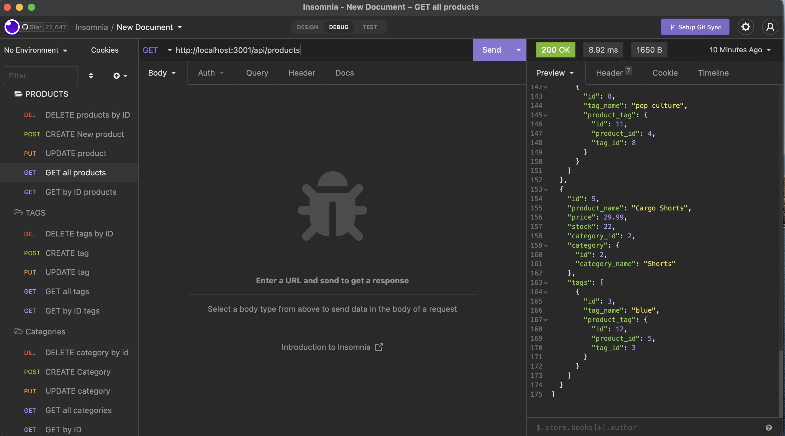
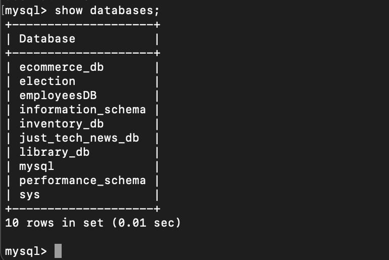

# E-Commerce Back End


## About

A RESTful catalog API for an e-commerce platform. Express 5 + Sequelize 6 + MySQL.
Models products, categories, and tags — including a many-to-many product↔tag relationship via a junction table — and exposes them through a small CRUD API with input validation and a write-protection key.

## Demo

The API has no UI; it is consumed by HTTP clients (Insomnia, Postman, `curl`, or a future frontend).




## Features

- **RESTful API** — CRUD endpoints for products, categories, and tags
- **Protected Writes** — `POST`, `PUT`, `DELETE` require an `x-api-key` header (constant-time compared)
- **Validated Payloads** — request bodies and route IDs are allowlisted and normalized before any database write
- **Sequelize ORM** — model definitions with associations and column constraints
- **Many-to-Many** — products and tags linked through a `ProductTag` junction table
- **Database Seeding** — one-command schema sync and seed data
- **Security Baseline** — `x-powered-by` disabled, baseline security headers, JSON body size limits, generic error handling

## Tech Stack

| Category | Technology |
|----------|------------|
| Runtime | Node.js 20+ |
| Framework | Express.js 5 |
| ORM | Sequelize 6 |
| Database | MySQL (via mysql2 driver) |
| Config | dotenv |
| Dev Tools | Nodemon, `node --test` |

## Getting Started

```bash
# Clone
git clone https://github.com/coleyrockin/E-commerce-BackEnd.git
cd E-commerce-BackEnd

# Install
npm install

# Configure
cp .env.example .env
# Edit .env: set DB_NAME, DB_USER, DB_PASSWORD, WRITE_API_KEY.
# Use a least-privilege MySQL user — do not use root.

# Create an empty database (in MySQL):
#   CREATE DATABASE ecommerce_db;
# Then seed it (this creates the tables via Sequelize sync and inserts demo data):
npm run seed

# Run
npm start          # node server.js
# or
npm run watch      # nodemon
```

Server listens on `http://localhost:3001`.

## Try it (curl)

```bash
# Health check
curl http://localhost:3001/api/health
# {"status":"ok"}

# Read — no auth required
curl http://localhost:3001/api/products

curl http://localhost:3001/api/categories/1

# Write — requires x-api-key matching WRITE_API_KEY
curl -X POST http://localhost:3001/api/categories \
  -H "Content-Type: application/json" \
  -H "x-api-key: $WRITE_API_KEY" \
  -d '{"category_name":"Outerwear"}'

# Update a product (only the fields you send are changed)
curl -X PUT http://localhost:3001/api/products/1 \
  -H "Content-Type: application/json" \
  -H "x-api-key: $WRITE_API_KEY" \
  -d '{"price": 19.99, "tagIds": [1, 3]}'

# Missing/wrong key → 401
curl -X DELETE http://localhost:3001/api/tags/1
```

## API Routes

| Method | Endpoint | Auth | Description |
|--------|----------|------|-------------|
| GET    | `/api/health`          | — | Liveness check |
| GET    | `/api/products`        | — | List products with category and tags |
| GET    | `/api/products/:id`    | — | Get product by id |
| POST   | `/api/products`        | key | Create product (`tagIds` optional) |
| PUT    | `/api/products/:id`    | key | Update fields and/or `tagIds` |
| DELETE | `/api/products/:id`    | key | Delete product |
| GET    | `/api/categories`      | — | List categories with their products |
| GET    | `/api/categories/:id`  | — | Get category by id |
| POST   | `/api/categories`      | key | Create category |
| PUT    | `/api/categories/:id`  | key | Update category |
| DELETE | `/api/categories/:id`  | key | Delete category |
| GET    | `/api/tags`            | — | List tags with their products |
| GET    | `/api/tags/:id`        | — | Get tag by id |
| POST   | `/api/tags`            | key | Create tag |
| PUT    | `/api/tags/:id`        | key | Update tag |
| DELETE | `/api/tags/:id`        | key | Delete tag |

## Tests

```bash
npm test
```

Covers the write-key middleware and the input-validation layer (allowlist, type coercion, ID validation).

## Security Notes

A separate audit lives in [`docs/SECURITY_AUDIT.md`](./docs/SECURITY_AUDIT.md).
Hardening already applied: parameterized ORM operations, body-size limits, security headers, write-key auth with constant-time compare, allowlist validation on every write.

## Project Structure

```text
E-commerce-BackEnd/
├── assets/img/         # Demo screenshots
├── config/             # Sequelize connection
├── docs/               # Security audit and other docs
├── middleware/         # write-auth (x-api-key)
├── models/             # Sequelize models and associations
├── routes/             # Express route handlers
├── seeds/              # Schema sync + seed data
├── tests/              # Unit tests (validators, middleware)
├── utils/              # Validation helpers
├── server.js           # Entry point
└── package.json
```

## What I Learned

- Modeling **many-to-many** relationships in Sequelize using a junction table (`ProductTag`) and `belongsToMany`.
- Writing a small but disciplined **request-validation** layer that allowlists fields and coerces types — and how much that simplifies the route handlers.
- Adding a **write-protection** layer with `crypto.timingSafeEqual` so a leaked key can't be brute-forced via timing.
- Using Express 5's improved async error propagation to keep handlers flat.

## Future Improvements

- Replace single-key write protection with proper user auth (JWT + roles).
- Add OpenAPI spec and Postman/Insomnia collection in `docs/`.
- Use real schema migrations (`umzug` or `sequelize-cli`) instead of `sync()` in production.
- Add `helmet`, `cors`, `morgan`, and `express-rate-limit` once a deployment target is chosen.
- Add integration tests against routes (supertest + sqlite test DB).
- Pagination on list endpoints.

## Known Limitations

- No frontend — this repo is the back end only.
- `sequelize.sync()` runs at boot. Fine for development; production needs migrations.
- Single shared write API key, not user-level authentication.
- No rate limiting (yet).
- `npm audit` flags `uuid <14` via Sequelize 6; upstream-blocked until Sequelize 7 upgrade.

## Author

Built by [Boyd Roberts](https://github.com/coleyrockin)
